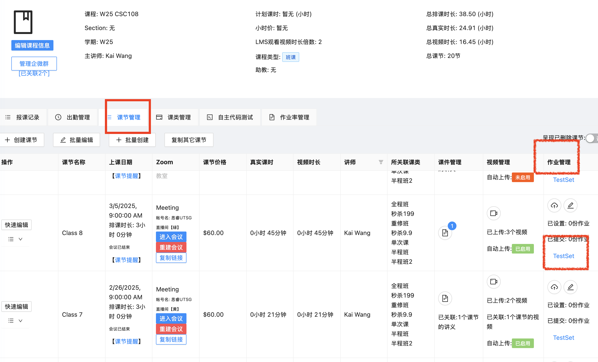
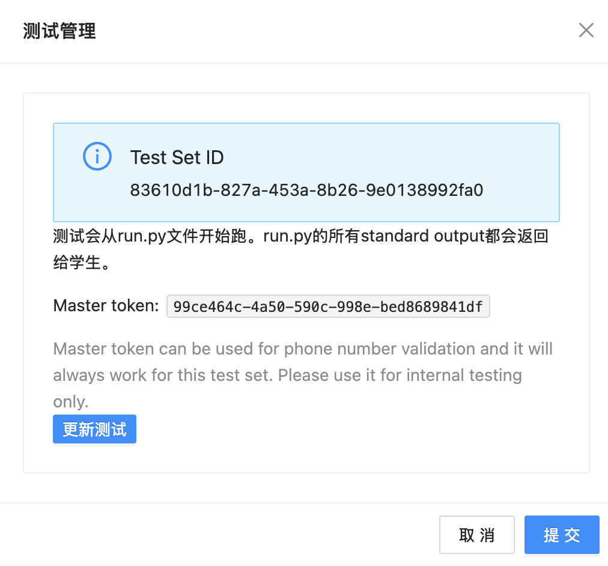

# Assignment Checker Guide

## Overview

This guide is for instructors who use the company's ERP system to manage courses. The Assignment Checker is an in-house solution designed to test students' code submissions in a secure environment, without exposing the testing suite to them.

## How It Works

The process involves three main components:

1.  **Your Test Suite**: You create a set of tests for an assignment.
2.  **The `checker` Tool**: A command-line executable (see `checker-executables`) distributed to students along with a runner script (see `example.py`).
3.  **The Backend Service**: A serverless function that securely runs your test suite against a student's submission.

The workflow is as follows:

1.  You prepare a test suite and upload it to the ERP system, which generates a unique **Test Set ID**.
2.  You provide students with the `checker` executable and a simple runner script (see `example.py`) configured with the Test Set ID and a list of files they need to submit.
3.  The student runs the script from their assignment folder.
4.  Before uploading, the `checker` validates the submission attempt. It confirms the student is enrolled in the course and verifies their machine's identity to prevent unauthorized sharing.
5.  If validation is successful, the `checker` tool archives and uploads their files to a secure location.
6.  The tool then invokes the backend service, which downloads your test suite and the student's submission into a temporary, isolated environment.
7.  The service runs your tests. It supports both **Python** and **Shell** scripts as test entry points.
8.  The output from the test run is **streamed** back in real-time to the student's console, providing them with immediate feedback.

## Getting Started for Teachers

### Step 1: Prepare Your Test Folder

1.  Create a directory for your test suite.
2.  Include all necessary files to run your tests (e.g., test scripts, helper modules, data files).
3.  **Crucially, do not include any files that you expect students to submit.** The student's files will be copied into your test folder, and any name conflicts could lead to files being overwritten.
4.  Zip the entire directory. When the zip file is extracted, it should result in a single folder containing all your test files.

### Step 2: Upload to ERP

1.  `校区中心 > 课程管理 > 课节管理 > 作业管理列 > TestSet 按钮` 
2.  Upload your zip file.
3.  Select your main test script as the "test entry point". This can be a Python (`.py`) or a Shell (`.sh`) script.
4.  Once uploaded, the system will provide you with a **Test Set ID** and a **Master Token**. 

### Step 3: Prepare the Runner for Students

1.  You will be provided with a boilerplate runner script (e.g., `example.py`).
2.  Edit this script to include:
    - The **Test Set ID** you obtained from the ERP.
    - A list of the filenames you expect students to submit.
3.  Bundle this runner script with the `checker` executable (we provide builds for major operating systems).
4.  Distribute the bundle to your students.

**Note on Distribution**: The `checker` binary is universal. Once a student has it on their machine, they do not need to download it again for other assignments. They will only need the new, assignment-specific runner script (`example.py`) for each new test.

### Step 4: Instruct Your Students

- Teach students to place the `checker` executable and the runner script in their assignment folder.
- They can then execute the runner script (e.g., `python example.py` or by clicking a "Run" button in their IDE) to submit their code and see the test results.

### Example Test Folder Structure

- **Instructor's Upload (`Archived.zip`):**
  ```
  Archived.zip
  └── A1/
      ├── a1_checker.py  (Test Entry Point)
      ├── index.py
      └── utils/
          ├── constants.py
          └── utils.py
  ```
- **Student's Submission:**

  - The student is asked to submit a file named `functions.py`.

- **Assembled on the Server:**
  - The `A1` directory is used as the root. The student's `functions.py` is placed inside it.
  ```
  /tmp/some_random_id/
  ├── functions.py
  ├── a1_checker.py
  ├── index.py
  └── utils/
      ├── constants.py
      └── utils.py
  ```

## Managing Your Tests

### Viewing Submissions

You can view a detailed log of all student submissions, including their code, test results, and any errors, in the ERP system by navigating to:
`课程管理 > 自主代码测试`

### Updating a Test Suite

If you need to update your test suite (e.g., to fix a bug in the tests or add more cases), simply re-upload the new `.zip` file to the same Test Set in the ERP.

The `testSetId` will remain the same, so **no changes are required on the student's side**. The next time a student runs the checker, the backend service will automatically download and use your latest test suite.

### Master Token

- Each Test Set has a unique Master Token.
- This token can be used in place of a student's `phone` number in the runner script.
- When the Master Token is used, all validation steps are skipped.
- This is intended for instructors to validate their test suite and check results without needing a registered student account. **Keep your Master Token secure and do not share it with students.**

## Writing Test Scripts

### Supported Runtimes

The backend service can execute test scripts written in:

- **Python**: Files ending with `.py` will be executed with `python3`.
- **Shell**: Files ending with `.sh` will be executed with `/bin/bash`.

Make sure your test entry point has the correct file extension.

### Python Environment

If your Python test script requires third-party libraries, you can include a `requirements.txt` file in your test folder. The backend service will automatically run `pip install -r requirements.txt` before executing your test script.

The following libraries are pre-installed in the testing environment:
| Name | Version |
| ----------- | ----------- |
| Python | 3.10.9 |
| pytest | 8.0.0 |
| pytest-timeout | 2.2.0 |
| python-ta | 2.7.0 |
| requests | 2.31.0 |
| networkx | 3.4.2 |
| numpy | 2.2.4 |

### C Environment

| Name  | Version |
| ----- | ------- |
| gcc   | 8.3.0   |
| clang | 18.1.8  |

### Execution and Timeout

- Your test script will be executed from the root of the assembled test directory (which contains your test suite and the student's files).
- The execution has a timeout of **60 seconds**. If your test runs longer than this, it will be terminated, and a timeout error will be returned.

### Resource Limits

**Storage:** Each test instance is allocated a total of **512MB** of disk space. Exceeding this limit will cause the test to fail with a "no space left on device" error.

This shared space is consumed by several components, often faster than expected:

- **Your Test Suite**: The compressed `.zip` file and its uncompressed contents.
- **Student's Submission**: The submitted code files.
- **Installed Dependencies**: Often the largest consumer. A `requirements.txt` file can trigger downloads and installations that use hundreds of megabytes.
- **Runtime Artifacts**: Any temporary or compiled files (e.g., `.o` files, executables) created during the test run.

To avoid storage errors, it is crucial to keep your test suite and, most importantly, its dependencies as lean as possible.

## Security and Validation

To ensure academic integrity, the Assignment Checker performs several validation steps before a test is run.

### Course Enrollment Check

The system first verifies that the student (identified by the phone number in the runner script) is enrolled in the course associated with the Test Set ID. If they are not an active participant, the submission is rejected.

### Machine Verification

To prevent students from sharing the checker and runner script with others, the system creates a digital fingerprint of the student's machine on their first submission for a given assignment. Subsequent submissions must originate from the same machine. If a submission is attempted from a different machine, it will be denied with a message indicating the checker is for personal use only.

These checks are bypassed when the instructor's `Master Token` is used, allowing for easy testing and validation of the test suite.
